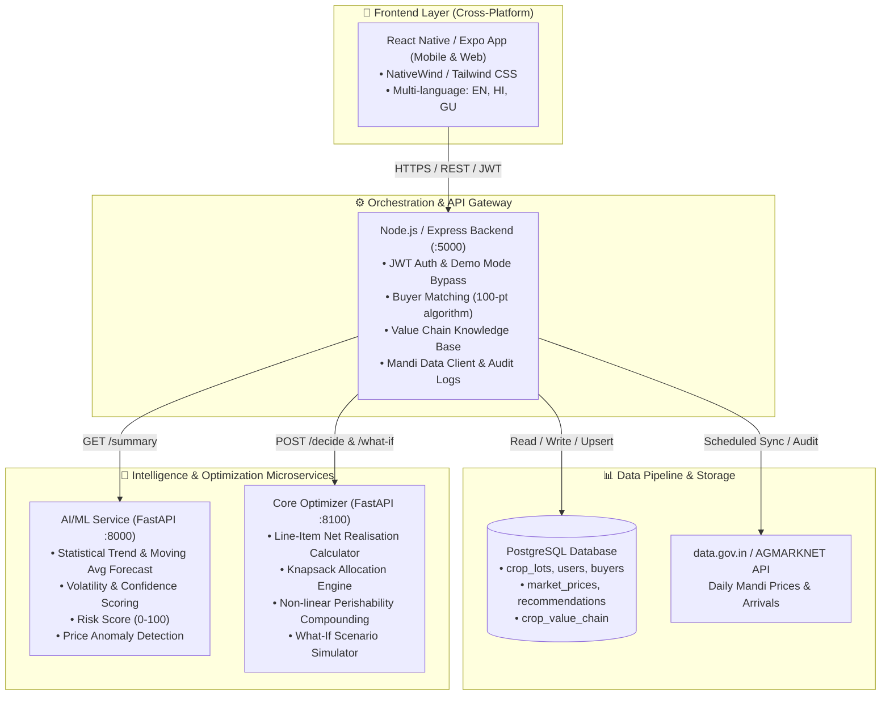

# 🌱 KRISHINITI — Agricultural Decision Intelligence Platform

> **Smart India Hackathon 2026** · **Problem Statement ID:** 26132 · **Team:** FarmIntel  
> *A transparent, explainable decision layer for the agricultural value chain — empowering farmers to discover their true net realization.*

---

## 📌 Executive Summary

**KRISHINITI** is not a simple mandi price tracker, and it is not a generic e-commerce marketplace. 

When a farmer harvests a crop lot (e.g., 25 quintals of groundnut in Rajkot), they face an economic optimization problem:
> **"Should I sell today, store and wait, split across buyers, or aggregate with an FPO — and what will I actually take home in cash after transport, storage compounding, mandi cess, and quality discounts?"**

KRISHINITI ingests the farmer's actual lot parameters and provides a mathematically backed, line-item financial recommendation (**SELL**, **STORE**, **SPLIT**, or **AGGREGATE**) factoring in real-world market volatility, storage decay, transport costs, and quality compliance.

---

## 🏗️ System Architecture

KRISHINITI is architected as a modular monorepo consisting of four core decoupled layers:



---

## 📁 Repository Map

```text
6-krishiniti-FULL-monorepo/
├── frontend/               # React Native (Expo SDK 57) mobile & web application
│   ├── src/
│   │   ├── app/            # File-based routes (Dashboard, Crop-Lot, Decision, Market, Value-Chain)
│   │   ├── components/     # UI components (Status cards, tables, badges, language switchers)
│   │   ├── context/        # Auth and Language context providers (EN, HI, GU)
│   │   └── services/       # Client-side API connectors and typing definitions
│   └── package.json
│
├── backend/                # Node.js / Express API & data orchestration service
│   ├── config/             # Database connection pool (pg) and auth middlewares
│   ├── migrations/         # PostgreSQL schema migrations
│   ├── routes/             # REST endpoints (auth, cropLots, market, decision, buyers, usage)
│   ├── services/           # Microservice clients, fallback policy, buyer matching
│   ├── tests/              # Zero-dependency test harness (136 automated assertions)
│   ├── schema.sql          # Idempotent DB schema definitions
│   └── server.js           # Server entry point (:5000)
│
├── ai-ml/                  # Python FastAPI service for forecasting & anomaly detection
│   ├── src/
│   │   ├── anomaly/        # Price spike, statistical outlier, and stale streak detection
│   │   ├── forecast/       # Explainable moving-average and trend forecasting
│   │   ├── risk/           # Volatility- and trend-weighted risk scoring (0-100)
│   │   └── api/main.py     # FastAPI application entry (:8000)
│   └── requirements.txt
│
├── Core/                   # Python Decision & Optimization engine
│   ├── engine/             # Math models: net_realisation, optimizer, sale_window, portfolio
│   ├── port/               # AI/ML contract adapters and guardrails
│   ├── service/            # FastAPI decision wrapper (:8100) and what-if handlers
│   └── requirements.txt
│
├── krishiniti_crop_valuechain_final.csv  # 105 value-chain industry mappings across 20 crops
├── render.yaml             # Multi-service cloud deployment specification (Render Blueprint)
├── start-local.js          # One-command orchestration script for local development
└── PROTOTYPE.md            # Comprehensive SIH submission & technical design documentation
```

---

## 🌟 Key Capabilities

### 1. Line-Item Net Realization
Rather than showing gross market rates, KRISHINITI computes exact financial breakdowns:
$$\text{Net Realization} = \text{Gross Revenue} - \text{Transport Cost} - \text{Compounded Storage Cost} - \text{Mandi Cess/Commission} - \text{Quality Discount}$$
*Risk adjustments are isolated into a separate, visible metric ($\lambda \times \text{Volatility} \times Q$) so non-cash risk weighting is never conflated with actual liquid cash.*

### 2. Strict Data-Honesty & Fallback Policies
KRISHINITI enforces data provenance and never displays ambiguous "Live" labels:
- **Case A (`fresh`)**: Verified AGMARKNET daily report synced within 36 hours.
- **Case B (`stale`)**: Cached official mandi data older than 36 hours. Recommendations carry a visible degradation warning.
- **Case C (`unavailable`)**: No official price exists. **Numeric recommendations are disabled** with an honest retry prompt; inventory and buyer discovery continue to operate.
- **Case D (`historical demo`)**: Historical Gujarat dataset used exclusively for offline demonstrations, training, and charting.

### 3. Realistic Quality Assurance Claims
- **Self-Declared (Rank 0)**: Farmer-declared grade with zero verification claim.
- **Photo-Assisted (Rank 1)**: Visual evidence captured for prospective buyer review. No unverified computer vision algorithm is claimed.
- **Certificate Upload (Rank 2)**: Document metadata recorded (`verification pending`). The system strictly avoids granting certified price premiums until verified by an accredited authority.

### 4. Deterministic Buyer Matching (100-Point Index)
Evaluates candidate buyers across:
- Commodity matching & distance / logistics feasibility
- Minimum/Maximum lot quantity constraints (triggers **AGGREGATE** recommendation if below buyer minimums)
- Quality compliance compatibility (incompatible buyers are highlighted with exact disqualification criteria)

### 5. What-If Scenario Simulation
Enables farmers to dynamically adjust storage rates, cash urgency deadlines, or target markets to instantly evaluate shifts in their optimal sale horizon.

---

## 🔌 API & Data Contracts

### 1. AI/ML Service Contract (`GET /summary`)
**Request:**
```http
GET /summary?commodity=Groundnut&market=Rajkot&days=5
```
**Response Shape:**
```json
{
  "commodity": "Groundnut",
  "market": "Rajkot",
  "forecast": {
    "status": "success",
    "last_price": 5100.0,
    "trend": "Stable",
    "confidence": "High",
    "volatility_cv": 0.067,
    "forecast": [
      { "date": "2026-09-21", "predicted_price": 5120.0, "lower_bound": 4980.0, "upper_bound": 5260.0 }
    ]
  },
  "risk": {
    "risk_score": 28.5,
    "risk_level": "Low",
    "risk_status": "ok"
  },
  "anomaly": {
    "anomaly_flag": false,
    "anomaly_type": "None",
    "anomaly_status": "ok"
  }
}
```

### 2. Decision Engine Contract (`POST /decide`)
**Input Payload:**
```json
{
  "lot": {
    "commodity": "Groundnut",
    "market": "Rajkot",
    "quantity": 25.0,
    "unit": "quintal",
    "grade": "Grade A",
    "quality_method": "self_declared",
    "storage_available": true,
    "storage_cost_per_unit_per_day": 2.0,
    "cash_requirement": 50000.0,
    "transport_cost": 1200.0
  },
  "buyers": [],
  "summary": { "/* AI/ML Summary Object */" }
}
```
**Output Decisions:**
- `action`: `SELL` | `STORE` | `SPLIT` | `AGGREGATE` | `UNAVAILABLE`
- `allocations`: Explicit quantity splits with associated buyer, location, and net realization line items.

---

## 🚀 Getting Started

### Prerequisites
- **Node.js**: v18.0.0 or higher
- **Python**: v3.10 to v3.13
- **PostgreSQL**: v14 or higher (Optional for pure offline testing; required for full backend persistence)

---

### Method A: Automated Local Orchestration (Recommended)

Run all services simultaneously using the built-in launcher:
```bash
node start-local.js
```
*Optional Flags:*
- `--no-frontend` : Launches only the backend, AI/ML, and Core engine services.
- `--skip-install`: Skips package dependency checks on startup.
- `--setup-db`    : Runs schema migrations and seeds demo data into PostgreSQL.

Service URLs once initialized:
| Service | Local Address | Interactive Documentation |
|---|---|---|
| **AI/ML Service** | `http://localhost:8000` | `http://localhost:8000/docs` |
| **Core Optimizer** | `http://localhost:8100` | `http://localhost:8100/docs` |
| **Backend API** | `http://localhost:5000` | `http://localhost:5000/health` |
| **Frontend App** | `http://localhost:8081` | Expo Metro Bundler |

---

### Method B: Manual Service Initialization

#### 1. Backend Service
```bash
cd backend
npm install
cp .env.example .env    # Configure DATABASE_URL and JWT_SECRET
npm run db:setup        # Applies schema.sql and seeds initial demo buyers
npm start               # Runs Express on port 5000
```

#### 2. Core Decision Engine
```bash
cd Core
python -m venv .venv
# Windows: .venv\Scripts\activate | Unix: source .venv/bin/activate
pip install -r requirements.txt
uvicorn service.app:app --reload --port 8100
```

#### 3. AI/ML Forecasting Service
```bash
cd ai-ml
python -m venv .venv
# Windows: .venv\Scripts\activate | Unix: source .venv/bin/activate
pip install -r requirements.txt
uvicorn src.api.main:app --reload --port 8000
```

#### 4. Frontend Application
```bash
cd frontend
npm install
npx expo start --web
```

---

## 🧪 Verification & Automated Tests

The repository includes a comprehensive, isolated test suite (334 total checks) that validates business logic, financial math, API safety, and data honesty:

```bash
# 1. Backend Test Suite (136 checks — pure isolated harness, zero network/DB required)
cd backend && npm test

# 2. Decision Orchestrator & Math Suite (61 checks)
python -m Core.service.test_decision

# 3. Core Engine Mathematical Tests (137 checks)
python -m Core.engine.test_aiml_integration
python -m Core.engine.test_net_realisation
python -m Core.engine.test_portfolio
python -m Core.engine.test_sale_window
python -m Core.engine.test_scenarios
python -m Core.engine.test_whatif
```

---

## 🔒 Security & Privacy Practices

- **Zero API Key Leakage**: Official `data.gov.in` keys remain backend-exclusive. Loggers, exception handlers, and URLs pass through redaction filters (`mandiDataClient.redact()`).
- **No Client Secrets**: The React Native application bundle contains zero database credentials or third-party API keys.
- **Non-destructive Idempotency**: All database migration scripts adhere to `CREATE IF NOT EXISTS` and `ADD COLUMN IF NOT EXISTS`.

---

## 📜 License

This project is licensed under the MIT License.
